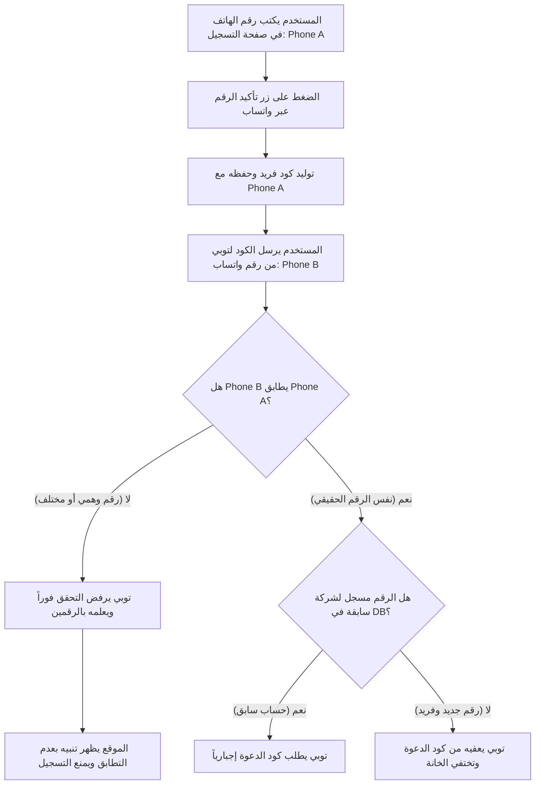

# نظام التحقق الصارم من رقم الهاتف عبر واتساب وتوبي (Strict WhatsApp Phone Match Verification)

تم تحديث النظام لفرض **التحقق الصارم من مطابقة رقم مرسل الواتساب مع رقم الهاتف المدخل في استمارة التسجيل**، لمنع كتابة أي أرقام وهمية وتخطي كود الدعوة.

---

## 🔒 كيف يعمل نظام الحماية والمطابقة الآن؟

---

## 🛡️ حالات التحقق الثلاث:

### 1. حالة الرقم الوهمي أو المختلف (Phone Mismatch):
- **السيناريو:** العميل كتب في الموقع `01000000000` وأرسل الكود من واتساب برقم `01069440045`.
- **رد توبي على واتساب:**
  > *"⚠️ **عفواً، رقم الواتساب غير متطابق!**\nأنت ترسل الرسالة من رقم واتساب (`01069440045`)، بينما الرقم المدخل في صفحة تسجيل الشركة هو (`01000000000`).\n\n📌 يرجى الرجوع لصفحة التسجيل وكتابة رقم هاتفك الصحيح (`01069440045`) والضغط على زر التأكيد مجدداً."*
- **تفاعل الموقع:** يظهر إشعار باللون الأحمر: *"⚠️ رقم الواتساب الذي أرسلت منه لا يطابق الرقم المدخل في الاستمارة"*. ويتم **حظر التسجيل** وعدم إعفائه من كود الدعوة.

---

### 2. حالة الرقم الحقيقي المطابق والمسجل سابقاً (Existing Company Account):
- **السيناريو:** العميل كتب في الموقع `01099235404` وأرسل الكود من نفس رقم الواتساب `01099235404` (المسجل لشركة سابقة مثل `بروفن`).
- **رد توبي على واتساب:**
  > *"✅ **تم التحقق من رقم هاتفك بنجاح!**\n⚠️ لكن هذا الرقم (`01099235404`) مسجل بالفعل بحساب شركة (`بروفن`).\n\n📌 لإتمام إنشاء حساب جديد بهذا الرقم، ستحتاج لإدخال **كود الدعوة** في الموقع، أو يمكنك تسجيل الدخول بحسابك السابق."*
- **تفاعل الموقع:** تظل خانة كود الدعوة **ظاهرة وإجبارية للتسجيل**.

---

### 3. حالة الرقم الحقيقي المطابق والجديد تماماً (Genuine New Company):
- **السيناريو:** العميل كتب في الموقع `01088887777` وأرسل الكود من نفس رقم الواتساب `01088887777` (غير مسجل في النظام).
- **رد توبي على واتساب:**
  > *"✅ **تم تأكيد رقم هاتفك بنجاح!**\n🎉 رقمك (`01088887777`) جديد وغير مسجل من قبل، **تم إعفاؤك من كود الدعوة**.\n\n🚀 يمكنك الآن الرجوع لصفحة الموقع وإكمال إنشاء حساب شركتك فوراً بدون كود دعوة."*
- **تفاعل الموقع:** تختفي خانة كود الدعوة تماماً ويتم إنشاء الحساب مباشرة وبسلاسة.
